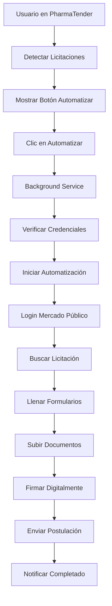

# PharmaTender - Extensión de Licitaciones

Una extensión de Chrome para automatizar el proceso completo de postulación a licitaciones desde PharmaTender hacia Mercado Público.

## 🎯 Funcionalidades

### ✅ Completadas
- **Configuración Centralizada**: Sistema modular de configuración con URLs, selectores y timeouts
- **Gestión Segura de Credenciales**: Encriptación AES-256 para credenciales de Clave Única
- **Automatización Inteligente**: Detección automática de páginas y contexto
- **Interfaz de Usuario Completa**: Popup con panel de control, configuración y monitoreo
- **Background Service**: Coordinación centralizada de automatizaciones
- **Detección de Plataforma**: Reconocimiento automático de licitaciones en PharmaTender
- **Sistema de Notificaciones**: Retroalimentación visual del progreso

### 🔄 En Desarrollo
- **Funciones de Subida de Documentos**: Automatización completa de carga de archivos
- **Gestión de Firma Digital**: Integración con firma electrónica
- **Validación Avanzada**: Verificación de datos antes del envío
- **Sistema de Logs**: Registro detallado de actividades
- **Manejo de Errores**: Recuperación automática y reintentos inteligentes

## 📁 Estructura del Proyecto

```
Licitaciones-Extension v1/
├── manifest.json                 # Configuración de la extensión
├── background.js                 # Service worker para coordinación
├── popup.html                    # Interfaz de usuario principal
├── popup.js                      # Lógica de la interfaz
├── popup-styles.css              # Estilos de la interfaz
├── config.js                     # Configuración centralizada
├── security-utils.js             # Gestión segura de credenciales
├── content-licitacion.js         # Automatización principal
├── content-platform.js           # Detección de plataforma
└── icons/                        # Iconos de la extensión
    ├── icon16.png
    ├── icon32.png
    ├── icon48.png
    └── icon128.png
```

## 🚀 Instalación

### Método 1: Cargar Extensión en Desarrollo

1. **Abrir Chrome** y navegar a `chrome://extensions/`
2. **Habilitar "Modo de desarrollador"** en la esquina superior derecha
3. **Hacer clic en "Cargar extensión desempaquetada"**
4. **Seleccionar la carpeta** `Licitaciones-Extension v1`
5. **La extensión aparecerá** en la lista y en la barra de herramientas

### Método 2: Instalación Manual

```bash
# Navegar al directorio del proyecto
cd "c:\Users\equip\OneDrive\Escritorio\Pharmatender\Desarrollo\Licitaciones-Extension v1"

# Verificar archivos
dir

# Cargar en Chrome desde chrome://extensions/
```

## ⚙️ Configuración Inicial

### 1. Configurar Credenciales

1. **Hacer clic en el icono** de la extensión en Chrome
2. **Ir a la pestaña "Credenciales"**
3. **Ingresar RUT y clave** de Clave Única
4. **Hacer clic en "Guardar"**

> 🔒 **Seguridad**: Las credenciales se encriptan localmente y nunca se envían a servidores externos.

### 2. Ajustar Configuración

1. **Ir a la pestaña "Config"** en el popup
2. **Configurar opciones**:
   - Login Automático: ✅ Recomendado
   - Timeout: 30 segundos (por defecto)
   - Reintentos: 3 (por defecto)
   - Notificaciones: ✅ Recomendado
3. **Guardar configuración**

## 🔧 Uso

### Automatización Básica

1. **Abrir PharmaTender** (prime.pharmatender.cl)
2. **Navegar a una licitación**
3. **La extensión detectará automáticamente** las licitaciones disponibles
4. **Hacer clic en "🤖 Automatizar"** en cualquier licitación
5. **El proceso se ejecutará automáticamente**

### Monitoreo del Progreso

- **Abrir el popup** para ver automatizaciones activas
- **Verificar estado** en tiempo real
- **Recibir notificaciones** cuando se complete

## 🏗️ Arquitectura Técnica

### Componentes Principales

#### 1. **Background Service Worker** (`background.js`)
- Coordina todas las automatizaciones
- Gestiona múltiples procesos simultáneos
- Mantiene estado persistente
- Programa verificaciones periódicas

#### 2. **Content Scripts**
- **`content-licitacion.js`**: Automatización principal del flujo
- **`content-platform.js`**: Detección de licitaciones en PharmaTender

#### 3. **Configuración y Seguridad**
- **`config.js`**: URLs, selectores y parámetros centralizados
- **`security-utils.js`**: Encriptación AES-256 para credenciales

#### 4. **Interfaz de Usuario**
- **`popup.html/js/css`**: Panel de control completo
- Gestión de credenciales, configuración y monitoreo

### Flujo de Automatización



## 🔍 Funciones Avanzadas

### Sistema de Configuración

```javascript
// Configuración modular en config.js
const EXTENSION_CONFIG = {
    URLS: {
        PHARMATENDER_BASE: 'https://prime.pharmatender.cl',
        MERCADO_PUBLICO_BASE: 'https://www.mercadopublico.cl',
        LOGIN_CLAVE_UNICA: 'https://accounts.claveunica.gob.cl'
    },
    
    SELECTORS: {
        LOGIN: {
            RUT_INPUT: '#rut',
            PASSWORD_INPUT: '#password',
            LOGIN_BUTTON: '#login-submit'
        },
        
        LICITACION: {
            SEARCH_INPUT: '#codigo-licitacion',
            SEARCH_BUTTON: '.btn-buscar',
            RESULT_LINK: '.licitacion-link'
        }
    },
    
    TIMEOUTS: {
        PAGE_LOAD: 15000,
        ELEMENT_WAIT: 10000,
        FORM_SUBMIT: 5000
    }
};
```

### Gestión Segura de Credenciales

```javascript
// Encriptación AES-256 en security-utils.js
class SecureCredentialManager {
    async saveCredentials(credentials) {
        const encrypted = await this.encrypt(JSON.stringify(credentials));
        await chrome.storage.local.set({ encryptedCredentials: encrypted });
    }
    
    async getCredentials() {
        const stored = await chrome.storage.local.get(['encryptedCredentials']);
        if (stored.encryptedCredentials) {
            const decrypted = await this.decrypt(stored.encryptedCredentials);
            return JSON.parse(decrypted);
        }
        return null;
    }
}
```

## 🛠️ Desarrollo y Personalización

### Agregar Nuevos Selectores

```javascript
// En config.js
SELECTORS: {
    NUEVO_MODULO: {
        SELECTOR_1: '#mi-selector',
        SELECTOR_2: '.mi-clase'
    }
}
```

### Extender Automatización

```javascript
// En content-licitacion.js
async function nuevaFuncionAutomatizacion() {
    const config = window.EXTENSION_CONFIG;
    
    // Usar configuración centralizada
    const selector = config.SELECTORS.NUEVO_MODULO.SELECTOR_1;
    const timeout = config.TIMEOUTS.ELEMENT_WAIT;
    
    // Implementar lógica
    await this.waitForElement(selector, timeout);
    // ... resto de la lógica
}
```

## 📊 Monitoreo y Logs

### Estados de Automatización

- **`running`**: Proceso en ejecución
- **`completed`**: Completado exitosamente  
- **`error`**: Error durante el proceso
- **`stopped`**: Detenido manualmente
- **`cancelled`**: Cancelado por cierre de tab
- **`timeout`**: Tiempo agotado

### Debugging

```javascript
// Habilitar modo debug en configuración
debugMode: true

// Los logs aparecerán en:
// 1. Consola del background script
// 2. Consola de content scripts
// 3. Panel de la extensión (próximamente)
```

## 🚨 Resolución de Problemas

### Problemas Comunes

#### 1. **Credenciales no guardadas**
- Verificar que el RUT tenga formato válido: `12345678-9`
- Revisar que la clave sea correcta
- Comprobar permisos de storage de la extensión

#### 2. **Automatización no inicia**
- Verificar que la página sea PharmaTender o Mercado Público
- Comprobar que los content scripts estén cargados
- Revisar consola por errores de JavaScript

#### 3. **Proceso se detiene**
- Verificar conexión a Internet
- Comprobar que los selectores no hayan cambiado
- Revisar timeouts en configuración

### Logs de Debugging

```bash
# Abrir DevTools en:
# 1. Popup de la extensión: F12
# 2. Background script: chrome://extensions/ > "service worker"
# 3. Content scripts: F12 en la página web
```

## 📋 TODO - Próximas Funciones

### Alta Prioridad
- [ ] **Completar funciones TODO** en `content-licitacion.js`
- [ ] **Implementar subida de documentos** por tipo
- [ ] **Integrar firma digital** 
- [ ] **Validación completa de formularios**
- [ ] **Manejo robusto de errores**

### Media Prioridad
- [ ] **Sistema de logs detallado**
- [ ] **Recuperación automática de fallos**
- [ ] **Soporte para múltiples licitaciones simultáneas**
- [ ] **Configuración avanzada de selectores**
- [ ] **Exportar/importar configuración**

### Baja Prioridad
- [ ] **Integración con API de PharmaTender**
- [ ] **Reportes de actividad**
- [ ] **Programación de automatizaciones**
- [ ] **Soporte para otros portales de licitaciones**

## 👥 Contribución

### Para Desarrolladores

1. **Fork del repositorio**
2. **Crear branch para features**: `git checkout -b feature/nueva-funcionalidad`
3. **Seguir convenciones de código**:
   - Usar ES6+ JavaScript
   - Comentarios descriptivos
   - Manejo de errores try/catch
   - Console.log con emojis para debugging
4. **Probar extensivamente**
5. **Submit Pull Request**

### Convenciones de Código

```javascript
// ✅ Buena práctica
try {
    console.log('🔄 Iniciando proceso...');
    const result = await procesarDatos();
    console.log('✅ Proceso completado:', result);
    return result;
} catch (error) {
    console.error('❌ Error en proceso:', error);
    throw error;
}

// ❌ Evitar
processData(); // Sin manejo de errores
console.log('data'); // Sin contexto
```

## 📄 Licencia

Este proyecto está bajo licencia MIT. Ver archivo `LICENSE` para más detalles.

## 🆘 Soporte

### Contacto
- **Issues**: Usar GitHub Issues para reportar bugs
- **Features**: Solicitar nuevas funcionalidades vía Issues
- **Documentación**: Contribuir a mejorar este README

### Información del Sistema
- **Chrome**: Versión mínima 88+
- **Manifest**: Version 3
- **Permisos**: activeTab, storage, notifications, alarms, tabs

---

**Desarrollado con ❤️ para automatizar licitaciones en PharmaTender**